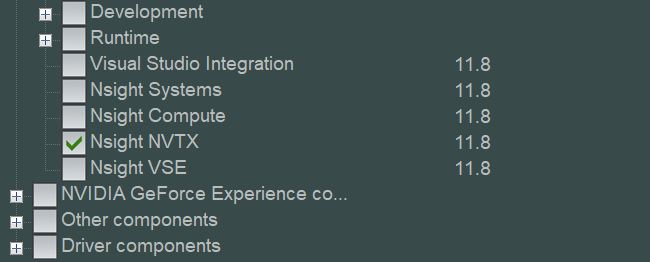
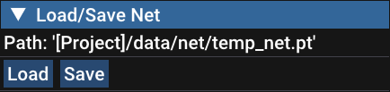
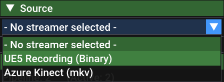
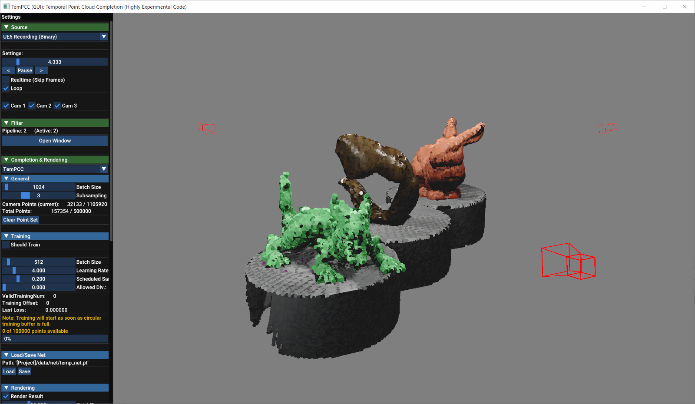

# TemPCC: Completing Temporal Occlusions in Large Dynamic Point Clouds Captured by Multiple RGB-D Cameras

#### [Paper](https://diglib.eg.org/handle/10.2312/egs20251039) | [Video](https://cgvr.cs.uni-bremen.de/papers/eg2025/tempcc/TemPCC_EG2025s_Video.mp4) | [Slides](https://cgvr.cs.uni-bremen.de/papers/eg2025/tempcc/TemPCC_EG2025s_Slides.pdf) | [Supplementary](https://cgvr.cs.uni-bremen.de/papers/eg2025/tempcc/TemPCC_EG2025s_Supplementary_Material.pdf)

C++ implementation of our technique for temporally completing dynamic point clouds of multiple RGB-D cameras, using LibTorch and CUDA. We provide a GUI application which can train our TinyFlowNet(TFN) and visualize the results on both synthetic and real-world scenes.

[Andre Mühlenbrock¹](https://orcid.org/0000-0002-7836-3341), [Rene Weller¹](https://orcid.org/0009-0002-2544-4153), [Gabriel Zachmann¹](https://orcid.org/0000-0001-8155-1127)\
¹Computer Graphics and Virtual Reality Research Lab ([CGVR](https://cgvr.cs.uni-bremen.de/)), University of Bremen

Presented at Eurographics 2025 - Short Papers


**Note:** TemPCC is a highly experimental and actively evolving project. It was developed primarily as a rapid prototyping environment to explore new ideas with minimal software architecture overhead. For publication it was extracted out of a larger project framework. The codebase is not production-ready and may contain unresolved issues, including potential memory leaks (e.g., when switching rendering techniques or streamers). Stability and robustness were not the primary goals during development for this specific project. If you have any questions or issues, don't hesitate to contact me!


## Model, Dataset and Dataset Generator
Our pre-trained **TinyFlowNet** models: 
 - Trained using Optimal Flow: [new_trained_optimalflow.pt (5.25 MiB)](https://github.com/muehlenb/TemPCC/raw/refs/heads/main/data/net/new_trained_optimalflow.pt)
 - Trained using PDFlow: [new_trained_pdflow.pt (5.25 MiB)](https://github.com/muehlenb/TemPCC/raw/refs/heads/main/data/net/new_trained_pdflow.pt) 
 
The RGB-D captures with ground truth data of our synthetic scenes:
 - [Training Scene (1.61 GiB)](https://cgvr.cs.uni-bremen.de/papers/eg2025/tempcc/dataset/TemPCC_TrainingScene.7z)
 - [Validation Scene A (1.11 GiB)](https://cgvr.cs.uni-bremen.de/papers/eg2025/tempcc/dataset/TemPCC_ValidationSceneA.7z)
 - [Validation Scene B (1.68 GiB)](https://cgvr.cs.uni-bremen.de/papers/eg2025/tempcc/dataset/TemPCC_ValidationSceneB.7z)

## Build Requirements

Note: We tested the following CUDA and LibTorch versions with this project

 - **CUDA Toolkit 12.1** with **Libtorch 2.2.1+cu121**
 
Ensure that the following requirements are met:

 - **CMake** ≥ 3.11
 - **OpenGL** ≥ 3.3
 - **C++ Compiler**, e.g. MSVC v143
 - **CUDA Toolkit 12.1**
   - Note: LibTorch requires *Nsight NVTX*, which is not installed by *CUDA 12.1* and higher. Without installing it, there will be a CMake error. In the community, the workaround is to **additionally** download the CUDA Toolkit 11.8 installer and just select the *Nsight NVTX* component. Afterwards, no additional configuration should be required, the CMakeLists.txt will simply work. So, during using the 11.8 installier, only select:
	
	
	For more information about this workaround, see: https://github.com/pytorch/pytorch/issues/116242
   
 - **LibTorch 2.2.1**
   - Download LibTorch: https://download.pytorch.org/libtorch/cu121/
     - E.g., for Windows (Release Version), select *libtorch-win-shared-with-deps-2.2.1%2Bcu121.zip*
	
	- **Warning:** You need to choose the version which corresponds to your build settings (Release or Debug). Otherwise, the source code might not compile (e.g. an error at the TinyFlowNet definition will be thrown). I suggest to use the **Release version** and compile the project in **RelWithDebInfo** mode.
 
 
 - **Azure Kinect SDK 1.4.1 (optional)** 
   - When you not only want to use synthetic Unreal Engine scenes, but also load the CWIPC-SXR scenes, you have to install the Azure Kinect SDK 1.4.1.

Note: The **PDFlow** algorithm stored at `src/pcrenderer/pdflow` is from https://github.com/MarianoJT88/PD-Flow and was slightly adapted to support Azure Kinects (resolution and projection related changes). Thanks to **MarianoJT88** for providing the source code!

*Additionally, this project uses small open-source libraries that we have directly integrated into our source code, thus no separate installation is required. You can find them in the `lib` folder. 
A big thank you to the developers of
[Dear ImGui 1.88](https://github.com/ocornut/imgui),
[nlohmann/json](https://github.com/nlohmann/json),
[GLFW 3.3](https://www.glfw.org/),
[stb_image.h](https://github.com/nothings/stb),
[tinyobjloader](https://github.com/tinyobjloader/tinyobjloader),
[imfilebrowser](https://github.com/AirGuanZ/imgui-filebrowser), and
[GLAD](https://gen.glad.sh/).*
## Build from Source

When running CMAKE, you should define the following variables:

- Set `Torch_DIR` to `[EXTRACTED_LIBTORCH_FOLDER]/libtorch/share/cmake/Torch/`

When you want support for loading the CWIPC-SXR dataset (recorded with Microsoft Azure Kinect), please ensure that you have the Microsoft Azure Kinect SDK 1.4.1 installed. Then:

- Set `USE_KINECT` to `ON`. When using Windows 10, you are finished (assuming you used default paths of the Azure Kinect SDK when installing). When working on Linux, please also define the `K4A_INCLUDE_DIR`, `K4A_LIB` and `K4A_RECORD_LIB` variables.

## Load Model and Scene
### Load Model
When running the software with initialized TemPCC, you can load the model by clicking "Load". Clicking on "Save" will override the model. The model is loaded from and stored to the `/data/net/temp_net.pt` path (CMake project folder).



### Load Synthetic Dataset
To load one of the synthetic datasets, you have to use the **UE5 Recording (Binary)** streamer. Just select it:



Then, select the **dataset.json** from the dataset folder (download above) to load the dataset including the synthetic RGB-D recordings and the ground truth data.

### Load Real-World CWIPC-SXR Dataset
To load the real-world dataset, choose **Azure Kinect (mkv)** and select the `cameraconfig.json` in the folder of the scene in the CWIPC-SXR dataset, which you want to load. Note that these scenes contain no ground truth information, meaning you **cannot** train the TinyFlowNet with them.

### Buffer sizes
**When initializing the TemPCC renderer, make sure to choose a point cloud buffer size appropriate for your scene.**
In our experiments, we used a point buffer size of **2,000,000 points** and a training buffer of **500,000 points**.
Please note that these settings require a GPU with sufficient VRAM to function properly (e.g. Nvidia GeForce 4090 RTX).


## Training Model
Training is only possible on the synthetic dataset, as it is the only one that contains ground truth flow data of occluded points.

To start training, open the Training tab and check **"Should Train"**. A training step is automatically performed whenever a new frame is loaded — therefore, the point cloud must be played. You can also switch between different scenes to continue training the current model on them.

### Scheduled Sampling
Training on temporal data introduces a classic chicken-and-egg problem: To predict the current flow at a given point, the model also relies on the previously predicted flow vectors at that point. However, these previous predictions themselves depend on the current state of the neural network. At the beginning of training, the model is not yet reliable, so using its own predictions can lead to unstable learning.

To address this, we use Scheduled Sampling: Early in training, we provide the model with the ground truth flow vectors from previous time steps. As training progresses and the model improves, we gradually replace these ground truth inputs with the model's own predicted flow vectors. This technique improves robustness and prepares the network to handle real-world scenarios, where ground truth data is not available at inference time.

### Circular Buffering
Additionally, we don't train the model on data from isolated frames. Instead, we sample training data from across the entire sequence of a scene to provide better temporal diversity. To facilitate this, we use a circular training buffer: as RGB-D frames are streamed in, they are continuously written into a fixed-size buffer. Once the buffer is full, it starts overwriting older data in a circular manner. Training only begins after the buffer has been filled for the first time.

## Screenshot



## Cite
```
@inproceedings{Muehlenbrock-2025-TemPCC,
    booktitle = {Eurographics 2025 - Short Papers},
    editor = {Ceylan, Duygu and Li, Tzu-Mao},
    title = {{TemPCC: Completing Temporal Occlusions in Large Dynamic Point Clouds captured by Multiple RGB-D Cameras}},
    author = {Mühlenbrock, Andre and Weller, Rene and Zachmann, Gabriel},
    year = {2025},
    publisher = {The Eurographics Association},
    ISSN = {1017-4656},
    ISBN = {978-3-03868-268-4},
    DOI = {10.2312/egs.20251039}
}
```
