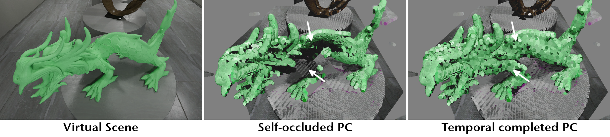

**Note:** This repository is currently a work in progress, as the TemPCC component still needs to be extracted from a larger application into a smaller, standalone project. This process — including refactoring and code documentation — will be completed by April 14th, 2025. Currently, for transparency purposes only, the TemPCC related classes can be found in `/unrefactored_classes/`

# TemPCC: Completing Temporal Occlusions in Large Dynamic Point Clouds Captured by Multiple RGB-D Cameras

#### Paper (soon) | Video (soon) | Slides (soon) | Supplementary (soon) 

C++ implementation of our technique for temporally completing dynamic point clouds of multiple RGB-D cameras, using LibTorch and CUDA. We provide a GUI application which can train and evaluate our TinyFlowNet(TFN) and visualize the results on both synthetic and real-world scenes.

[Andre Mühlenbrock¹](https://orcid.org/0000-0002-7836-3341), [Rene Weller¹](https://orcid.org/0009-0002-2544-4153), [Gabriel Zachmann¹](https://orcid.org/0000-0001-8155-1127)\
¹Computer Graphics and Virtual Reality Research Lab ([CGVR](https://cgvr.cs.uni-bremen.de/)), University of Bremen

Conference information will follow.



## Pre-built Binaries
**TODO**

**Note:** This application relies on CUDA 12.1 and requires an NVIDIA graphics card with compatible support.

## Model, Dataset and Dataset Generator
Our pre-trained model: 
 - [temp_net.pt (5.25 MiB) **TODO**]()
 
The RGB-D captures of our synthetic scenes we used in the paper can be found here: 
 - [Synthetic Scenes (X.X GiB)  **TODO**]()

Furthermore, we provide the **Unreal Engine 5 project** with which we generated the synthetic RGB-D captures, including occluded ground truth points. If you want to generate training data of your own scenes, you can find more information in the README of the subfolder:
 - [How to generate your own synthetic RGB-D captures for training **TODO**](tools/training_gen/Readme.md)

## Build Requirements

 - **CMake** ≥ 3.11
 - **OpenGL** ≥ 3.3
 - **C++ Compiler**, e.g. MSVC v143
 - **CUDA Toolkit 12.1**
 - **LibTorch 2.5.1**
 

*Additionally, this project uses small open-source libraries that we have directly integrated into our source code, thus no separate installation is required. You can find them in the `lib` folder. 
A big thank you to the developers of
[Dear ImGui 1.88](https://github.com/ocornut/imgui),
[nlohmann/json](https://github.com/nlohmann/json),
[GLFW 3.3](https://www.glfw.org/),
[stb_image.h](https://github.com/nothings/stb),
[tinyobjloader](https://github.com/tinyobjloader/tinyobjloader),
[imfilebrowser](https://github.com/AirGuanZ/imgui-filebrowser), and
[GLAD](https://gen.glad.sh/).*
## Build from Source
**TODO**

## Load Model and Scene
### Load Model
**TODO:** Put your .pt file into the `data/net/` folder and choose [...]

### Load Synthetic Dataset
**TODO:** To load the synthetic dataset, choose **BinaryStreamer** in the source tab and select [...].


### Load Real-World CWIPC-SXR Dataset
**TODO:** To load the real-world dataset, choose **AzureKinectMKVStreamer** in the source and select [...].

## Training Model
**TODO**

Training is only possible on the synthetic dataset, as it is the only one that contains ground truth flow data of occluded points.

To start training, open the Training tab. A training step is automatically performed whenever a new frame is loaded — therefore, the point cloud must be played. You can also switch between different scenes to continue training the current model on them.

Information to provide: TODO: Describe in detail how the training data is sampled while the point cloud is running (e.g., specify the Circular Buffer Size and explain how temporal data is sampled, if anyone want to change this).
## Code Overview

**TODO:** Code is quite complex and not directly described in the paper; describe how information of the whole point cloud is prepared, copied and moved on GPU so we can train and evaluate using Libtorch, especially the pre-processing, and post-processing (to integrate it into the scene). This is currently done by `cudaMainPassKernelPartA` function (pre pass) and `cudaMainPassKernelPartB` (post pass).


## Cite
```
Citing information will follow soon
```
